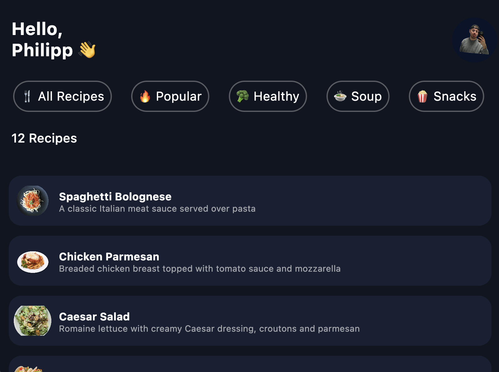
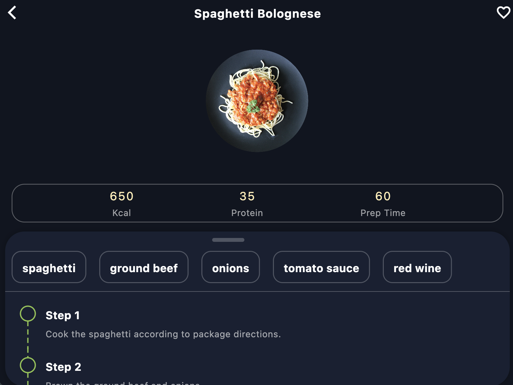

# flutterdemo

CPD SS24

## Getting Started

# CPD

CPD :
-Dart 
-Flutter
-Cross Pattform (IOS / MacOS)
-Muss funktionieren
-Keine APIs

YumYumNavigator

Willkommen bei YumYumNavigator – deinem ultimativen Begleiter für kulinarische Entdeckungen! Diese Flutter-App für iOS und MacOS führt dich auf eine geschmackvolle Reise durch die Welt der Rezepte. Von herzhaften Suppen bis hin zu gesunden und würzigen Gerichten – hier findest du alles, was dein Gaumen begehrt.

YumYumNavigator präsentiert eine Vielzahl von Rezepten, die nach Kategorien wie Suppen, Gesundheit, Schärfe und mehr sortiert werden können. Das Beste daran? Alle Daten für die Rezepte werden in einem JSON-Format gespeichert, denn diese App wurde entwickelt, um ohne Backend auszukommen. Alles ist sofort bereit und ohne internet erreichbar, um deine kulinarischen Abenteuer zu unterstützen.

Lass dich von YumYumNavigator inspirieren und entdecke neue Geschmackswelten – jetzt kannst du mit einem Fingertipp dein nächstes kulinarisches Meisterwerk erschaffen! Guten Appetit!

Screenshots Desktop-Version:

Startbildschirm:

Rezeptübersicht

Rezeptdetailansicht
